# Multi-IMU Thesis Analysis Workflow

This repository contains the offline processing stack for dual-IMU cycling data (bike-mounted Sporsa + rider-mounted Arduino).

## 1) Reproducible entry point (recommended)

Run the full workflow via a single config file:

```bash
cd analysis
uv sync
uv run python -m workflow --config configs/workflow.thesis.json
```

- `workflow` is the top-level orchestrator for thesis-quality reruns.
- `pipeline` remains the lower-level stage runner.

---

## 2) Workflow stages (clear separation)

| Stage | Responsibility | Main module(s) |
|---|---|---|
| Data loading | Parse raw session files to normalized per-recording CSVs | `parser/` |
| Preprocessing | Recording-level checks and section splitting | `parser/stats.py`, `parser/split_sections.py` |
| Synchronization | Align Sporsa/Arduino streams (SDA/LIDA/Calibration/Online) | `sync/` |
| Calibration / orientation | World-frame calibration and orientation estimation | `calibration/`, `orientation/` |
| Feature extraction | Window features + exports | `features/`, `derived/` |
| Event analysis | Candidate event extraction from derived/orientation streams | `events/` |
| Evaluation | Baselines and experiment runs | `evaluation/` |
| Visualization / reporting | Plots, QC views, and section summary artifacts | `visualization/`, `pipeline/section_summary.py` |

---

## 3) Concise workflow diagram

```mermaid
flowchart LR
    A[Raw session logs\ndata/sessions] --> B[parser.session\nrecording parsed CSVs]
    B --> C[sync.pipeline\naligned recording streams]
    C --> D[parser.split_sections\nsection folders]
    D --> E[calibration.calibrate\nworld-frame signals]
    E --> F[orientation.estimate\nattitude variants]
    F --> G[derived.compute\ninterpretable signals]
    G --> H[events.extract\nevent candidates]
    G --> I[features.extract\nwindow/event features]
    H --> I
    I --> J[validation + exports\nqc_section + tables]
    J --> K[visualization + reports]
```



---

## 4) Configuration handling

Use `configs/workflow.thesis.json` to control:
- dataset root (`data_root`),
- method choices (`sync_method`, `orientation_filter`, `frame_alignment`),
- run behavior (`force`, `no_plots`, `skip_exports`),
- event thresholds (`event_config_path`, `min_event_confidence`),
- reproducible subset selection (`session`, `recordings`).

Example:

```bash
uv run python -m workflow --config configs/workflow.thesis.json
```

Optional one-off override:

```bash
uv run python -m workflow --config configs/workflow.thesis.json --sync-method calibration
```

---

## 5) Environment and dependency setup

Requirements:
- Python `>=3.13`
- `uv` (recommended)

Setup:

```bash
cd analysis
uv sync
```

The project dependencies are defined in `pyproject.toml`.

---

## 6) Module quick links

- `workflow/`: config-driven orchestration (`python -m workflow`)
- `pipeline/`: lower-level stage orchestration (`python -m pipeline`)
- `parser/`: raw log parsing and section splitting
- `sync/`: multi-method stream synchronization
- `calibration/`, `orientation/`: world-frame and attitude
- `derived/`, `events/`, `features/`: signal derivation, events, and feature tables
- `validation/`, `evaluation/`: QC tiers and experiment evaluation
- `visualization/`: diagnostics and thesis plots

---

## 7) Dead code / abandoned path review (suggested cleanup)

The following items look like likely cleanup candidates in the **main branch** and should be reviewed before deletion:

1. Legacy parser variants (`parser/arduino.py` vs `parser/arduino_batched.py`) — keep one canonical parser path if both are no longer required.
2. Multiple overlapping visualization runners (`visualization/run_all_recordings.py`, ad-hoc plotting scripts) — converge into one reporting entry point.
3. Legacy convenience entry (`main.py`) — currently retained for backward compatibility; can be removed after migration to `python -m workflow`.
4. Historical notes (`orientation/THESIS_DYNAMIC_ORIENTATION_NOTES.md`) — consider moving to `docs/archive/` if no longer actively used.

---

## 8) Remaining technical debt checklist

- [ ] Add schema validation for `configs/workflow.thesis.json` (JSON Schema + CI check).
- [ ] Add smoke tests for `python -m workflow` on a tiny fixture dataset.
- [ ] Standardize logging output per stage (structured JSON log option).
- [ ] Add deterministic seeds where randomness appears in evaluation workflows.
- [ ] Move one-off visualization scripts into `visualization/tools/` and keep `visualization/` import-safe.
- [ ] Add formal deprecation policy for legacy modules to avoid branch drift.
