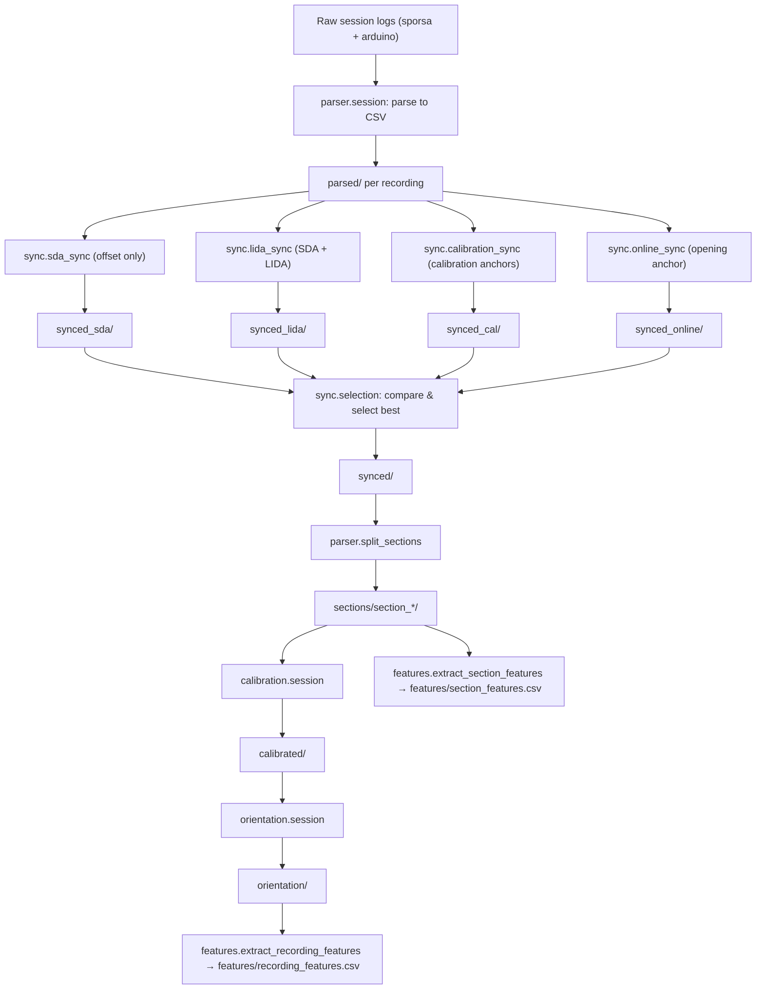

# master-thesis/analysis

Python toolkit for offline analysis, synchronization, calibration, and
visualization of multi-IMU cycling data used in the thesis.

The code turns raw logs from a bicycle-mounted Sporsa IMU and a rider-mounted
Arduino IMU into synchronized, calibrated, world-frame signals and diagnostic
plots that can be used for motion and fall / incident analysis.

## Terminology

- **Session**: one acquisition day containing multiple recordings, identified
  by a date string such as `2026-02-26`. Raw logs live under
  `analysis/data/sessions/<session_name>/`.
- **Recording**: one continuous multi-IMU file pair, stored under
  `analysis/data/recordings/<session_name>_<index>/`, for example
  `2026-02-26_5`. All intermediate processing stages are per-recording.
- **Section**: a contiguous sub-interval of a recording between two detected
  calibration sequences. Sections live under
  `analysis/data/recordings/<recording_name>/sections/section_N/` and are the
  main unit for detailed motion and incident analysis.

Wherever the code or README refers to these concepts, it uses the above
definitions.

---

## Project layout

- **`common/`**
  - CSV schema utilities and helpers for loading/writing DataFrames with a
    consistent column layout.
  - Path helpers (`paths.py`) for locating data directories
    (`sessions/`, `recordings/`, per-stage folders).
  - Convenience helpers such as `find_sensor_csv(recording_name, stage, sensor_name)`.

- **`parser/`**
  - High-level session parsing (`parser.session`) from raw logs to per-recording
    `parsed/` CSVs.
  - Device-specific parsers for Arduino (new + legacy) and Sporsa logs.
  - Recording-level statistics (`parser.stats`) for timing and quality analysis.
  - Calibration-based sectioning (`parser.split_sections`) that detects
    calibration sequences and splits recordings into sections.

- **`calibration/`**
  - Centralised calibration-sequence detection (`calibration.segments`):
    `find_calibration_segments` and the `CalibrationSegment` dataclass are the
    shared definition used by `parser.split_sections`, `calibration.static_windows`,
    and `sync.calibration_sync`.
  - Static window extraction (`calibration.static_windows`).
  - Sensor-level bias and gravity calibration (`calibration.per_sensor`).
  - World-frame orientation calibration (`calibration.orientation`).
  - Recording-level calibration pipeline (`calibration.session`) that writes
    `calibrated/` CSVs and `calibration.json`.

- **`sync/`**
  - Four synchronization methods for aligning Sporsa and Arduino IMU streams:
    - **SDA only** (`sync.sda_sync` → `synced_sda/`): offset-only, no drift.
    - **SDA + LIDA** (`sync.lida_sync` → `synced_lida/`): offset + drift from windowed refinement.
    - **Calibration sync** (`sync.calibration_sync` → `synced_cal/`): offset + drift from tap-burst anchors.
    - **Online sync** (`sync.online_sync` → `synced_online/`): causal single-anchor + pre-characterised drift.
  - Comparison and selection (`sync.selection`) to evaluate all methods and copy the best to `synced/`.
  - Session-level orchestration (`sync.session`) that runs all methods, selects the best, and prints a summary.
  - Core algorithm modules: `drift_estimator` (LIDA), `align_df` (SDA), `metrics`, `common`.
  - See [`sync/README.md`](sync/README.md) for full algorithm and API documentation.

- **`orientation/`**
  - Quaternion math and fusion filters (complementary and Madgwick).
  - Single-file orientation pipeline (`orientation.pipeline`).
  - Recording-level orientation sweep (`orientation.session`) that runs
    multiple filter / calibration variants and produces `orientation_stats.json`.

- **`features/`**
  - Low-level windowed IMU feature computation (`features.window_features`):
    duration, acceleration magnitude, gyroscope magnitude, and jerk statistics
    (min, max, mean, std, percentiles).
  - Recording- and section-level orchestration (`features.section_features`):
    - `extract_recording_features(recording_name)` — reads all CSVs from a
      processing stage and writes `features/recording_features.csv`.
    - `extract_section_features(recording_name)` — iterates all `sections/section_*/`
      directories and writes `features/section_features.csv`.

- **`visualization/`**
  - Plotting tools for single-stream analysis and multi-stream comparison:
    - Sensor plots (`visualization.plot_sensor`).
    - Sporsa–Arduino comparison plots (`visualization.plot_comparison`).
    - Calibration segment diagnostic plots (`visualization.plot_calibration_segments`).
    - Orientation and calibration plots (`visualization.plot_calibration`,
      `visualization.plot_orientation`).
  - Session-level orchestration (`visualization.plot_session`) that iterates
    all recordings and stages and regenerates plots.

- **`run_full_pipeline.py`**
  - High-level orchestration script for the *thesis pipeline* that:
    - Parses all recordings for a session.
    - Synchronizes Sporsa and Arduino per recording.
    - Splits synchronized recordings into calibration-bounded sections.
    - Calibrates sensors into a world frame.
    - Runs orientation filters and computes quality metrics.
    - Regenerates plots for all stages.
    - Writes a compact JSON run log summarizing which recordings were
      successfully processed and which stages are available.

---

## Setup

- **Python**: `>= 3.13`
- **Recommended**: `uv` for dependency management and running tools.

From the repository root:

```bash
cd master-thesis/analysis
uv sync
```

This creates an isolated environment with all required dependencies
(`pandas`, `numpy`, `matplotlib`, etc.).

---

## Data layout

The analysis code expects the following directory structure relative to
`analysis/`:

- **Raw input (per session)**  
  `analysis/data/sessions/<session_name>/`  
  Each session directory contains device-specific subfolders, typically:
  - `arduino/*.txt`
  - `sporsa/*.txt`

- **Processed recordings**  
  `analysis/data/recordings/<recording_name>/` where
  `<recording_name> = "<session_name>_<index>"`, for example:
  - `analysis/data/recordings/2026-02-26_2/`
  - `analysis/data/recordings/2026-02-26_5/`

  Within each recording directory, the pipeline populates several *stages*:

  - `parsed/` – normalized per-sensor CSVs and basic plots.
  - `synced_sda/` – SDA offset-only synchronization (optional).
  - `synced_lida/` – SDA + LIDA synchronization (optional).
  - `synced_cal/` – calibration-anchor synchronization (optional).
  - `synced_online/` – single-anchor online synchronization (optional).
  - `synced/` – best selected method (written by `sync.selection --apply`).
  - `sections/section_N/` – per-section CSVs and plots, bounded by calibration
    events.
  - `calibrated/` – world-frame, bias-corrected sensor CSVs and
    `calibration.json`.
  - `orientation/` – orientation-enhanced CSVs and `orientation_stats.json`.
  - `features/` – flat CSV feature tables:
    - `recording_features.csv` – one row per (sensor, stage) for the full recording.
    - `section_features.csv` – one row per (sensor, section) across all sections.

- **Run logs**  
  `analysis/data/run_logs/<session_name>_pipeline_run.json`  
  Summaries written by `run_full_pipeline.py` for reproducibility.

---

## Canonical thesis pipeline

This section describes the end-to-end processing chain used for the thesis
results. It follows the concepts from the related-work chapter:
sensor-level calibration, system-level spatial alignment, application-layer
synchronization over BLE, and multi-IMU fusion in gravity-aligned frames.

### Quick start: run the full pipeline for a session

From `analysis/`:

```bash
uv run run_full_pipeline.py 2026-02-26 calibration
```

- **Input**:  
  Raw logs under `data/sessions/2026-02-26/{sporsa,arduino}/*.txt`.
- **Output** (per recording `2026-02-26_k`):
  - `parsed/` → `synced_*/` → `synced/` → `sections/` → `calibrated/` → `orientation/` → `features/`
  - Plots at each stage.
  - A run log at `data/run_logs/2026-02-26_pipeline_run.json`.

The `sync_method` argument can be:

- `calibration` (default): prefer calibration-sequence-based sync (`synced_cal/`).
- `lida`: use SDA + LIDA (`synced_lida/`).
- `none`: skip explicit synchronization and keep `parsed/` as the reference stage.

Only raw logs are treated as immutable; all derived stages can be regenerated
and overwritten.

---

## Stage 1 – Parse raw session logs (`parser.session`)

**Goal**: Convert device-specific logs into standardized per-recording IMU
CSVs with a consistent schema and units.

```bash
uv run -m parser.session <session_name>
# e.g. uv run -m parser.session 2026-02-26
```

- **Input**:  
  `data/sessions/<session_name>/{arduino,sporsa}/*.txt`

- **Output** (per recording `2026-02-26_k`):  
  `data/recordings/2026-02-26_k/parsed/`
  - `sporsa.csv`
  - `arduino.csv`
  - `session_stats.json`
  - Initial sanity-check plots (`*.png`)

Parsing normalizes:

- Timestamps to a common unit (`timestamp` in milliseconds).
- Accelerometer units to m/s².
- Gyroscope units to deg/s (downstream filters convert to rad/s).
- Optional magnetometer channels to a consistent scale.

**What to inspect**:

- `session_stats.json`: sampling rate, jitter, gaps, and Arduino dropout
  statistics.
- Parsed plots: obvious dropouts, saturations, or timestamp glitches.

Recordings with severe parsing issues (empty CSVs, extreme jitter, or
continuous dropouts) should be excluded from later stages.

---

## Stage 2 – Synchronize IMU streams (`sync/`)

Four methods are available. Run any or all of them, then use `sync.selection`
to pick the best result.

| Method | Module | Output dir | Drift? |
|---|---|---|---|
| SDA only | `sync.sda_sync` | `synced_sda/` | No |
| SDA + LIDA | `sync.lida_sync` | `synced_lida/` | Yes |
| Calibration anchors | `sync.calibration_sync` | `synced_cal/` | Yes |
| Online (single anchor) | `sync.online_sync` | `synced_online/` | Pre-characterised |

```bash
# Run all methods on a single recording + select best
uv run -m sync.session 2026-02-26_5 --apply --plot

# Run all methods on an entire session
uv run -m sync.session 2026-02-26 --all --apply

# Or run methods individually
uv run -m sync.calibration_sync 2026-02-26_5/parsed
uv run -m sync.lida_sync        2026-02-26_5/parsed
uv run -m sync.selection        2026-02-26_5 --apply --plot
```

The selected winner is written to `synced/` with `sync_info.json`,
`all_methods.json`, and a comparison plot.

See [`sync/README.md`](sync/README.md) for a full description of each method,
algorithm details, `sync_info.json` schema, and selection heuristics.

---

## Stage 3 – Split into calibration-bounded sections (`parser.split_sections`)

**Goal**: Turn each synchronized recording into multiple **sections**, each
bounded by two calibration sequences (opening and closing). These sections
are the atomic units for detailed motion and incident analysis.

```bash
uv run -m parser.split_sections <recording_name>/synced_cal
# e.g. uv run -m parser.split_sections 2026-02-26_5/synced_cal
```

- **Output**: `data/recordings/<recording_name>/sections/section_N/`
  - `sporsa.csv`, `arduino.csv`
  - Per-section sensor and comparison plots
  - Optional per-section `sync_info.json` when `sync=True`

Each section includes the closing calibration of the previous section and the
opening calibration of the next, making it suitable for:

- Local incident analysis.
- Comparing bicycle vs rider dynamics within a stable calibration window.

**Section inclusion hints**:

- Discard sections where:
  - Calibration detection fails or only one calibration sequence is present.
  - Plots show large gaps or obvious desynchronization.
- Prefer sections that:
  - Contain rich dynamic content (sprints, braking, bumps).
  - Have clean calibration motions at the boundaries.

---

## Stage 4 – World-frame calibration (`calibration.session`)

**Goal**: Align each sensor to a world frame and correct biases so that
accelerations and angular velocities are comparable across recordings and
sensors.

```bash
uv run -m calibration.session <recording_name> --stage synced_cal
# e.g. uv run -m calibration.session 2026-02-26_5 --stage synced_cal
```

- **Input**: `data/recordings/<recording_name>/synced_cal/`
- **Output**: `data/recordings/<recording_name>/calibrated/`
  - `calibration.json`
  - `sporsa.csv`, `arduino.csv` (bias-corrected, world-frame)
  - Calibration plots

The calibration pipeline:

1. Detects calibration sequences and extracts static windows.
2. Estimates per-sensor gyro bias, gravity vector, and magnetometer offsets.
3. Computes a sensor-to-world rotation (TRIAD when magnetometer is usable,
   gravity-only otherwise).
4. Applies bias correction and rotates all IMU vectors into the world frame.

**Calibration quality indicators** (`calibration.json`):

- `gravity_residual_m_per_s2` close to 0 (≲ 0.2) indicates good alignment.
- `n_static_samples` and `n_mag_samples` should be reasonably large.
- `yaw_calibrated` shows whether heading could be stabilised (magnetometer
  quality dependent).

Recordings where calibration fails or yields large residuals should not be
used for features that rely on absolute orientation; they may still be used
for magnitude-only features.

---

## Stage 5 – Orientation estimation and quality metrics (`orientation/`)

Orientation filters turn world-frame IMU data into quaternions and
gravity-compensated linear acceleration, which are key for incident features.

### Single-file pipeline (`orientation.pipeline`)

```bash
uv run -m orientation.pipeline <input.csv> [output.csv]
```

- **Input**: Any IMU CSV with `timestamp`, `ax`–`az`, `gx`–`gz` (e.g.
  `calibrated/sporsa.csv`).
- **Output**: `<input_stem>_orientation.csv` with:
  - `qw, qx, qy, qz`
  - `yaw_deg, pitch_deg, roll_deg` (optional)

### Recording-level sweep (`orientation.session`)

```bash
uv run -m orientation.session <recording_name>/calibrated
# e.g. uv run -m orientation.session 2026-02-26_5/calibrated
```

- **Output**: `data/recordings/<recording_name>/orientation/`
  - One CSV per (sensor, filter, calibration) variant:
    - `__complementary_raw_orientation.csv`
    - `__complementary_calib_orientation.csv`
    - `__madgwick_raw_orientation.csv`
    - `__madgwick_calib_orientation.csv`
  - `orientation_stats.json` with metrics such as:
    - Deviation of world-frame acceleration norm from gravity.
    - Fraction of samples classified as static.
    - Static pitch and roll variability.

Combined with plots from `visualization.plot_orientation`, these metrics
indicate which recordings (and which filters) produce reliable orientation
for incident analysis.

---

## Stage 6 – Visualization (`visualization/`)

Plots are produced automatically by the pipeline, but can also be regenerated
manually.

### Plot a single sensor stream

```bash
uv run -m visualization.plot_sensor <recording_name>/<stage> <sensor_name> [--norm] [--split]
```

- **Examples**:
  - `uv run -m visualization.plot_sensor 2026-02-26_5/parsed sporsa --norm`
  - `uv run -m visualization.plot_sensor 2026-02-26_5/calibrated arduino --norm`

### Compare two streams

```bash
uv run -m visualization.plot_comparison <recording_name>/<stage> [sensor_name_a] [sensor_name_b] [--norm]
```

Useful for visually validating synchronization (`parsed` vs `synced_*`) and
for comparing bicycle vs rider dynamics.

### Plot all recordings for a session

```bash
uv run -m visualization.plot_session <session_name> [--stage STAGE]
```

This iterates all recordings whose name starts with `<session_name>_` and
regenerates plots for each stage (including sections, calibrated, and
orientation).

---

## Data-quality criteria for motion and incident analysis

Downstream motion and incident detection experiments should only use
recordings and sections that meet basic quality criteria derived from
`sync_info.json`, `calibration.json`, and `orientation_stats.json`.

### Recording-level flags (suggested)

For each recording:

- **`sync_quality`**:
  - **good**:
    - Calibration-based sync available (`synced_cal/`).
    - `correlation.offset_and_drift ≥ 0.2`.
    - `|drift_seconds_per_second| ≤ 2e-3` (≤ 2000 ppm).
  - **marginal**:
    - Correlation between 0.05 and 0.2, or drift up to 5000 ppm.
  - **poor**:
    - Correlation < 0.05 or drift > 5000 ppm.

- **`calibration_quality`**:
  - **good**:
    - `gravity_residual_m_per_s2 ≤ 0.2`.
    - `n_static_samples ≥ 500`.
  - **marginal**:
    - Residual between 0.2 and 0.5, or fewer static samples.
  - **poor**:
    - Residual > 0.5 or calibration fails.

- **`orientation_quality`**:
  - Based on `orientation_stats.json` for the
    `__complementary_calib_orientation` variant:
    - `g_err_abs_mean ≤ 0.3` and static pitch/roll std ≤ 2° → **good**.
    - up to 5° std → **marginal**.
    - larger deviations → **poor**.

These thresholds are intentionally conservative and can be tuned as more data
are analysed. For thesis figures, focus on **good** and at most **marginal**
recordings; treat **poor** ones as diagnostic examples, not as training data.

### Section-level inclusion criteria

For each `sections/section_N/`:

- Both sensors present and non-empty.
- No long gaps or discontinuities in `timestamp`.
- If per-section sync is used, per-section `sync_info.json` should meet the
  same qualitative checks as at the recording level.
- Section contains sufficient dynamic content for the intended analysis
  (e.g. non-trivial energy in `acc_norm` for incident-like events).

Sections failing these checks are best excluded from incident / fall
modelling, but can still be used for qualitative inspection.

---

## Stage 7 – Feature extraction (`features/`)

**Goal**: Convert per-recording and per-section IMU CSVs into compact flat
feature tables suitable for incident analysis and machine learning.

### Recording-level features

```python
from features import extract_recording_features

csv_path = extract_recording_features("2026-02-26_5", stage="calibrated")
# → data/recordings/2026-02-26_5/features/recording_features.csv
```

### Section-level features

```python
from features import extract_section_features

csv_path = extract_section_features("2026-02-26_5")
# → data/recordings/2026-02-26_5/features/section_features.csv
```

Both functions accept an optional `sensors` iterable to restrict which sensor
CSVs are processed (matched against filenames).

**Feature columns** (per sensor, per row):

| Column group | Description |
|---|---|
| `n_samples`, `duration_s` | Sample count and duration. |
| `acc_{min,max,mean,std,p25,p50,p75}` | `acc_norm` (m/s²) statistics. |
| `gyro_{min,max,mean,std,p25,p50,p75}` | `gyro_norm` (deg/s) statistics. |
| `jerk_{min,max,mean,std,p25,p50,p75}` | Time-derivative of `acc_norm` statistics. |

**Output layout**:

```
data/recordings/<recording_name>/features/
    recording_features.csv
    section_features.csv
```

---

## Visual pipeline overview

The following diagram summarizes the main flow for a single recording:



In practice, the **thesis pipeline** selects the best sync method
automatically (preferring `synced_cal/` when calibration quality passes),
writes the result to `synced/`, then continues with `sections/`,
`calibrated/`, `orientation/`, and finally feature extraction.

