# Multi-IMU Thesis Analysis Workflow

This repository contains the offline processing stack for dual-IMU cycling data (bike-mounted Sporsa + rider-mounted Arduino).

## 1) Reproducible thesis entry point (official)

Run the full workflow via a single config file:

```bash
cd analysis
uv sync
uv run python -m workflow --config configs/workflow.thesis.json
```

- `workflow` is the top-level orchestrator for thesis-quality reruns.
- `pipeline` is an internal stage runner and is **not** the recommended thesis command.

---

## 2) Workflow stages (clear separation)

| Stage | Responsibility | Main module(s) |
|---|---|---|
| Data loading | Parse raw session files to normalized per-recording CSVs | `parser/` |
| Preprocessing | Recording-level checks and section splitting | `parser/stats.py`, `parser/split_sections.py` |
| Synchronization | Align Sporsa/Arduino streams (SDA/LIDA/Calibration/Online) | `sync/` |
| Calibration / orientation | World-frame calibration and orientation estimation | `calibration/`, `orientation/` |
| Feature extraction | Window features + exports | `features/`, `derived/` |
| Event analysis | Candidate event extraction from derived/orientation streams | `events/` |
| Evaluation | Baselines and experiment runs | `evaluation/` |
| Visualization / reporting | Plots, QC views, and section summary artifacts | `visualization/`, `pipeline/section_summary.py` |

---

## 3) Concise workflow diagram

```mermaid
flowchart LR
    A[Raw session logs\ndata/sessions] --> B[parser.session\nrecording parsed CSVs]
    B --> C[sync.pipeline\naligned recording streams]
    C --> D[parser.split_sections\nsection folders]
    D --> E[calibration.calibrate\nworld-frame signals]
    E --> F[orientation.estimate\nattitude variants]
    F --> G[derived.compute\ninterpretable signals]
    G --> H[events.extract\nevent candidates]
    G --> I[features.extract\nwindow/event features]
    H --> I
    I --> J[validation + exports\nqc_section + tables]
    J --> K[visualization + reports]
```



---

## 4) Configuration handling

Use `configs/workflow.thesis.json` to control:
- dataset root (`data_root`),
- method choices (`sync_method`, `orientation_filter`, `frame_alignment`),
- run behavior (`force`, `no_plots`, `skip_exports`),
- event thresholds (`event_config_path`, `min_event_confidence`),
- reproducible subset selection (`session`, `recordings`).

Example:

```bash
uv run python -m workflow --config configs/workflow.thesis.json
```

Optional one-off override:

```bash
uv run python -m workflow --config configs/workflow.thesis.json --sync-method calibration
```

---

## 5) Environment and dependency setup

Requirements:
- Python `>=3.13`
- `uv` (recommended)

Setup:

```bash
cd analysis
uv sync
```

The project dependencies are defined in `pyproject.toml`.

---

## 6) Module quick links

- `workflow/`: config-driven orchestration (`python -m workflow`)
- `pipeline/`: lower-level stage orchestration used by `workflow` (direct CLI is deprecated for thesis reruns)
- `parser/`: raw log parsing and section splitting
- `sync/`: multi-method stream synchronization
- `calibration/`, `orientation/`: world-frame and attitude
- `derived/`, `events/`, `features/`: signal derivation, events, and feature tables
- `validation/`, `evaluation/`: QC tiers and experiment evaluation
- `visualization/`: diagnostics and thesis plots

---

## 7) Thesis defaults and reproducibility notes

The default thesis config (`configs/workflow.thesis.json`) now encodes one consistent rerun profile:
- `sync_method: "best"` to evaluate all supported sync methods and select the best-scoring alignment.
- `orientation_filter: "complementary_orientation"` as the stable default for this dataset.
- `frame_alignment: "gravity_only"` to avoid forward-axis assumptions when magnetometer quality varies.
- `event_config_path: "event_thresholds.thesis.json"` so thresholds are explicit and versioned.
- `event_centered_features: true` with `min_event_confidence: 0.4` to prioritize physically plausible, detector-backed windows.

Every run through `workflow` writes a provenance manifest under `data/provenance/`.
